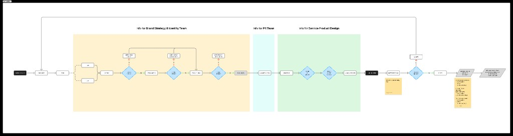
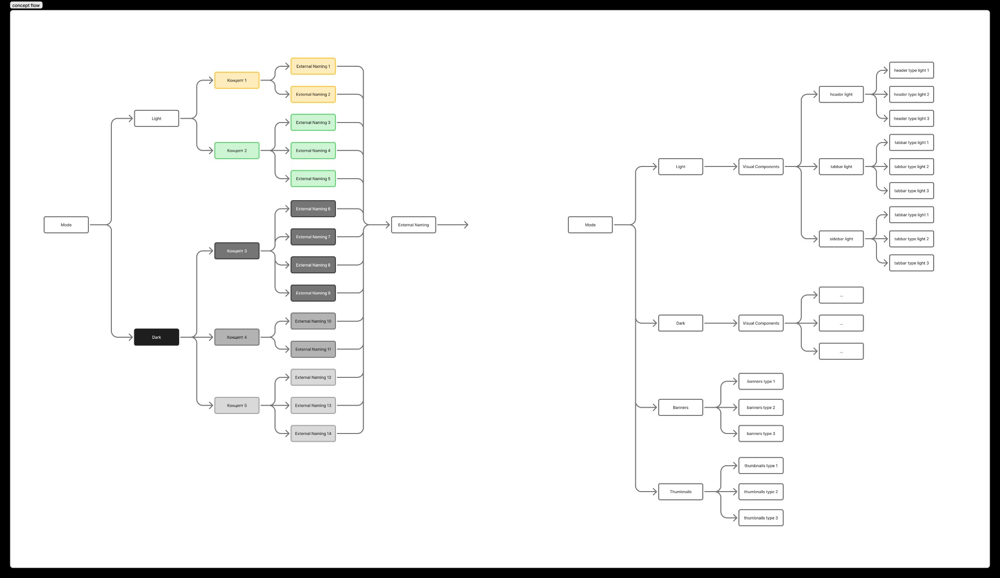

# NEW BRAND CONSTRUCTOR v2.0 — Product Requirements Document (PRD)

> **Джерело**: NEW BRAND CONSTRUCTOR v2.0 — Google Doc  
> **Flow-діаграми**: [FigJam Board](https://www.figma.com/board/1zmeAfI38nTCbt2hX7UrmM/brand_builder)

---

## Flow-діаграми

### General Flow

> [FigJam: General Flow](https://www.figma.com/board/1zmeAfI38nTCbt2hX7UrmM/brand_builder?node-id=2-743)

### Concept Flow

> [FigJam: Concept Flow](https://www.figma.com/board/1zmeAfI38nTCbt2hX7UrmM/brand_builder?node-id=2-773)

---

## 1. Загальний огляд

### 1.1 Мета продукту

Brand Constructor — інструмент для централізованого збору інформації для запуску нових онлайн-казино брендів. Система автоматизує комунікацію між замовником (Product Owner/CPO) та трьома ключовими командами:

- Brand Strategy & Identity
- Service Product Design
- PR & Marketing

### 1.2 Бізнес-задача

- **Проблема**: фрагментована комунікація при запуску нових брендів (2-4 бренди на рік)
- **Рішення**: єдиний інтерфейс з опитувальником + візуальною бібліотекою
- **Результат**: скорочення часу з 2 тижнів до 2-3 днів (85% економія)

---

## 2. Структура системи

### 2.1 Користувачі системи

**Основні користувачі:**

- Замовник (Product Owner, CPO) — заповнює бриф
- CEO — затверджує фінальний бриф (якщо все з бібліотек)
- Адміністратор бібліотек
  - Арт-дір, бренд дизайнер – наповнює контент щодо концептів (візуала, неймінгів)
  - PR-менеджер – змінює інформацію всередені PR пакетів
  - Product Designer – наповнює контент UI компонентів

**Отримувачі інформації:**

- Brand Strategy & Identity Team
- Service Product Design Team
- PR & Marketing Team

---

## 3. Детальний опис кроків

### Етап 1: Збір інформації (Кроки 1-9)

#### Крок 1: Brand Basics

GEO та основна інформація.

**Поля:**

- **GEO (Географія)** — обов'язкове
  - Input: текст або dropdown
  - Приклад: "UK, DE, PT"
- **Планована дата запуску** — обов'язкове
  - Input: date picker
  - Формат: DD.MM.YYYY
- **Коментар** — необов'язкове
  - Input: textarea
  - Placeholder: "Додайте ваші коментарі або побажання..."

**Дані для команд:** Brand Strategy & Identity, Service Product Design, PR & Marketing

**Валідація:** Без заповнення обов'язкових полів неможливо перейти далі

---

#### Крок 2: Mode (Тема інтерфейсу)

Вибір світлої або темної теми. Має вплив на концепти (під світлу/темну тему) — включно в MVP. Має вплив на UI компоненти — не включено в MVP конструктора.

**Опції:**

- Dark Mode
- Light Mode

**UI:** 2 великі картки з візуальним прикладом кожної теми

**Логіка:**

- Вибір Mode фільтрує концепти на наступному кроці
- Показуються тільки концепти відповідної теми

**Дані для команд:** Brand Strategy & Identity, Service Product Design

---

#### Крок 3: Concept Selection

Вибір концепту дизайну або замовлення нового.

**Опції:**

**A) Вибір з бібліотеки:**

- Показуються тільки концепти обраного Mode (Light/Dark з попереднього кроку)
- Можна обрати ЛИШЕ ОДИН концепт
- Кожен концепт відображається як картка з:
  - Thumbnail (попередній перегляд)
  - Назва концепту
  - Кнопка "Переглянути деталі"
  - Можливість відмітити, як обраний
- "Переглянути деталі" (модальне вікно):
  - Назва концепту
  - Опис концепту (якщо є)
  - Галерея зображень (2-3 картинки)
  - Mobile mockup preview
  - Web mockup preview
  - Коментар: Необов'язкове поле textarea

**B) Замовити новий концепт:**

- Кнопка: "+ New Concept"
- Бриф нового концепту (опитувальник):
  - Чи це нове ГЕО? — Yes/No
  - Опис, що не підійшло в запропонованих концептах — textarea, обов'язкове
  - Інформація по гравцям від команди Трафіку — textarea, обов'язкове (Підказка: "Хто наші користувачі по трафіку")
  - Потрібен Brand Research GEO? — Yes/No
  - Хто ключові конкуренти? — textarea
  - Чи важливо зберегти зв'язок з іншими продуктами компанії? — Yes/No + текстове поле "З якими?"
  - Яка мова створення назви? — dropdown (English, German, Portuguese, etc.)
  - Які слова/приставки хочеться бачити в назві? — textarea
  - Які доменні зони можна розглядати? — multi-select (.com, .net, .io, .co, etc.)
  - Бюджет домена в $? — number input
  - Дедлайн розробки назви і концепту — date picker, обов'язкове
  - Додаткова інформація по ГЕО — textarea

**Логіка:**

- Якщо обрано концепт з бібліотеки → перехід до Крок 4 (External Naming)
- Якщо замовлено новий концепт → пропуск Кроку 4, перехід до Крок 5 (Internal Naming)

**Дані для команд:** Brand Strategy & Identity

---

#### Крок 4: External Naming

Вибір зовнішнього неймінгу (назви бренду).

> **ВАЖЛИВО**: Цей крок показується ТІЛЬКИ якщо на Кроці 3 обрано концепт з бібліотеки

**Логіка відображення неймінгів:**

- Для кожного концепту є 3-10 привʼязаних External Names
- Показуються тільки неймінги обраного концепту
- Картка неймінгу містить:
  - Назва (наприклад: "CasinoMania")
  - Домен (.com)
  - Статус доступності:
    - ✅ Available (зелений) — доступний для покупки
    - ❌ Sold (сірий, неактивний) — вже продано
  - Ціна в $ (якщо доступний)
  - Кнопка "Обрати"

**Автоматичне оновлення:**

- Система перевіряє доступність домену
- Оновлює ціну з [GoDaddy](https://www.godaddy.com/)/Namecheap API (якщо можливо)
- Якщо домен проданий → картка стає неактивною з міткою "Sold"

**Вибір:**

- Можна обрати до 3 назв
- Якщо обрано більше 1 назви → поле "Коментар" стає обов'язковим

**Замовити новий неймінг:**

- Кнопка: "+ Create New External Name"
- Бриф нового неймінгу (опитувальник):
  - Чи це нове ГЕО? — Yes/No
  - Опис, що не підійшло в запропонованих неймінгах — textarea, обов'язкове
  - Інформація по гравцям від команди Трафіку — textarea, обов'язкове
  - Потрібен Brand Research GEO? — Yes/No
  - Яка мова створення назви? — dropdown
  - Які слова/приставки хочеться бачити в назві? — textarea
  - Які доменні зони можна розглядати? — multi-select
  - Яких слів, рішень, знаків хотілося б уникнути в назві? — textarea
  - Бюджет домена в $? — number input
  - Дедлайн розробки назви — date picker, обов'язкове
  - Додаткова інформація по ГЕО — textarea

**Дані для команд:** Brand Strategy & Identity

---

#### Крок 5: Internal Naming

Вибір внутрішньої кодової назви продукту.

> **Пояснення**: Внутрішня назва використовується для комунікації всередині компанії (наприклад: "Thor", "Alpa", "King")

**Опції:**

**A) Вибір з бібліотеки:**

- Список доступних внутрішніх назв
- Картки з назвами
- Можна обрати ЛИШЕ ОДНУ назву
- Коментар: Необов'язкове поле

**B) Замовити нову внутрішню назву:**

- Кнопка: "+ Create New Internal Name"
- Бриф нової внутрішньої назви:
  - Опис, що не підійшло в запропонованих неймінгах — textarea, обов'язкове

**Дані для команд:** Brand Strategy & Identity

---

#### Крок 6: Brand Preview

Перегляд та підтвердження вибраної інформації. Відображення залежить від вибору:

**Варіант A: Все обрано з бібліотек**

Показується:

- Обраний концепт: Назва, Thumbnail, Кнопка "Переглянути деталі", Коментар (якщо є)
- Обрана зовнішня назва (External Name): Назва + домен, Ціна, Коментар (якщо є)
- Обрана внутрішня назва (Internal Name): Назва, Коментар (якщо є)

Дії: Кнопка "Редагувати" — повернутись на конкретний крок, Кнопка "Далі" — продовжити

**Варіант B: Щось замовлено нове**

Показується:

- "Бриф нового концепту" (якщо замовлено) — Кнопка "Переглянути бриф" → відкриває modal з усіма відповідями, Кнопка "Редагувати" → дозволяє змінити відповіді
- "Бриф нового External Naming" (якщо замовлено) — Аналогічно
- "Бриф нової Internal Naming" (якщо замовлено) — Аналогічно
- \+ Показується все що обрано з бібліотек

Дії: Редагування кожного брифу окремо, Кнопка "Далі"

**Дані для команд:** Brand Strategy & Identity (весь набір)

---

#### Крок 7: PR Package

Вибір PR-пакету для запуску бренду (документ від PR).

> Детальні описи пакетів — див. [pr-packages-detailed.md](pr-packages-detailed.md)

**6 пакетів (картки):**

1. **Trust Focus (Starter)** — Строки: 2-3 тижні. Що входить: Сторінки на Trustpilot
2. **Social Trust (Базовий)** — Строки: 4-6 тижнів. Що входить: Trustpilot, Соціальні мережі
3. **Full Reputation (Стандарт)** — Строки: 4-6 тижнів. Що входить: Trustpilot, Соціальні мережі, Сторінки на основних оглядачах
4. **Media Reputation (Розширений)** — Строки: 6-8 тижнів. Що входить: Full Reputation + Медіарілейшенз
5. **Brand Excellence (Преміум)** — Строки: 8-12 тижнів. Що входить: Media Reputation + Креативні кампанії, Awards, Спонсорства
6. **Total Market Presence (Максимум)** — Строки: 10-14 тижнів. Що входить: Brand Excellence + Інфлюенс маркетинг

**UI кожної картки:**

- Назва пакету
- Іконка
- Строки впровадження
- Список включених функції в пакеті
- Кнопка "Дивитись детально" → modal з повним описом

**Вибір:** Можна обрати ЛИШЕ ОДИН пакет. Обраний пакет підсвічується. Коментар: Необов'язкове поле.

**Дані для команд:** PR & Marketing (+ Базова інформація з Кроку 1)

---

#### Крок 8: Deliverables

Додаткові опції для розробки.

**Опції:**

- Legal Landing (on/off)
- Partner Landing (on/off)

**Додаткові поля:**

- Дедлайн розробки — date picker, обов'язкове якщо хоч щось увімкнено
- Коментар — textarea, необов'язкове

**Дані для команд:** Service Product Design

---

#### Крок 9: Visual Components

Вибір типів візуальних компонентів для продукту.

> **MVP версія**: Компоненти показуються без фільтрації по Mode (Dark/Light)

**Структура інтерфейсу:**

- Ліва панель: Список категорій компонентів з варіантами
- Права панель: Live preview на iPhone mockup

**Категорії компонентів:**

- Хедер — Type 1 (thumbnail + назва), Type 2, Type 3
- Банери — Type 1, Type 2, Type 3
- Сабнейли — Type 1, Type 2
- Таббар — Type 1, Type 2, Type 3
- Сайдбар — Type 1, Type 2, Type 3

**Кнопка:** "На розсуд дизайнерів" — не обирати нічого конкретного

**Коментар:** Необов'язкове поле

**Preview (права панель):**

- iPhone 16 Plus mockup (масштаб 75%)
- Компоненти накладаються поверх mockup у правильних позиціях

**Дані для команд:** Service Product Design (+ Крок 1, Крок 2, Крок 8)

---

### Етап 2: CEO Approval

#### Крок 10: CEO Review & Approval

> **Важливо**: Цей крок з'являється ТІЛЬКИ якщо все обрано з бібліотек (не було заявок на нові концепти/неймінги)

**Що бачить CEO:**

Повний бриф з усіма секціями:

- Brand Basics (GEO, Дата запуску, Коментар)
- Mode (Light/Dark)
- Concept (Обраний концепт — картинка + назва, Коментар замовника)
- External Naming (Обрані назви 1-3, Коментар замовника)
- Internal Naming (Обрана назва, Коментар замовника)
- PR Package (Обраний пакет, Коментар замовника)
- Deliverables (Legal Landing yes/no, Partner Landing yes/no, Дедлайн, Коментар замовника)
- Visual Components (Обрані типи компонентів, Preview, Коментар замовника)

**Можливості CEO:**

1. **Додати коментарі** — До кожної секції можна додати коментар CEO. Коментарі зберігаються окремо від коментарів замовника. Обидва коментарі відображаються в фінальному документі.
2. **Змінити вибір** — CEO може обрати інший концепт з бібліотеки, CEO може обрати інший неймінг з бібліотеки. При зміні: Вибір замовника НЕ видаляється, додається вибір CEO як альтернатива. В документі видно обидва варіанти: "Обрано замовником: Концепт A" / "Обрано CEO: Концепт B"

**Рішення CEO (3 кнопки):**

- ✅ **Затвердити та відправити в роботу** — Фінальний бриф відправляється командам. Статус: "Approved". Перехід до Експорту.
- 📝 **Надати коментарі та повернути** — Бриф повертається замовнику. Статус: "Needs Revision". Замовник бачить коментарі CEO. Замовник може відредагувати та надіслати повторно.
- 🔄 **Переглянути бібліотеку** — CEO може відкрити бібліотеку концептів/неймінгів. Обрати альтернативний варіант. Продовжити approval процес.

---

### Етап 3: Export

#### Фінальний крок: Save & Export

Збереження та відправка брифу командам.

**Що відбувається:**

**1. Формування документів для команд:**

- **Brand Strategy & Identity** отримують: Базова інформація (GEO, дата, коментар), Інформація про аудіторію (з Крок 3), Обраний концепт АБО Бриф нового концепту, Обраний external naming АБО Бриф нового naming, Обраний internal naming АБО Бриф нової внутрішньої назви, Коментарі замовника та CEO (якщо є)
- **Service Product Design** отримують: Базова інформація (GEO, дата, коментар), Mode (Dark/Light), Deliverables (Legal Landing, Partner Landing, дедлайн), Visual Components (обрані типи), Коментарі замовника та CEO (якщо є)
- **PR & Marketing** отримують: Базова інформація (GEO, дата, коментар), Обраний PR пакет (деталі, строки), Коментарі замовника та CEO (якщо є)

**2. Експорт в системи:**

- **Confluence**: Створюється структурована сторінка з розділами для кожної команди, з посиланнями на візуальні матеріали
- **Jira**: Створюються задачі для кожної команди з відповідною інформацією та дедлайнами, з посиланнями на Confluence
- **Slack**: Повідомлення в канали команд з коротким описом та посиланнями

**3. Фінальний екран:**

Показується:

- ✅ "Бриф успішно створено!"
- Унікальний ID брифу (наприклад: BRIEF-2025-001)
- Дата створення
- Список команд-отримувачів
- Посилання на документи (Confluence, Jira)

**Кнопки:**

- "Переглянути бриф" — PDF версія
- "Створити новий бриф" — повернутись на початок
- "Повернутись на головну"
